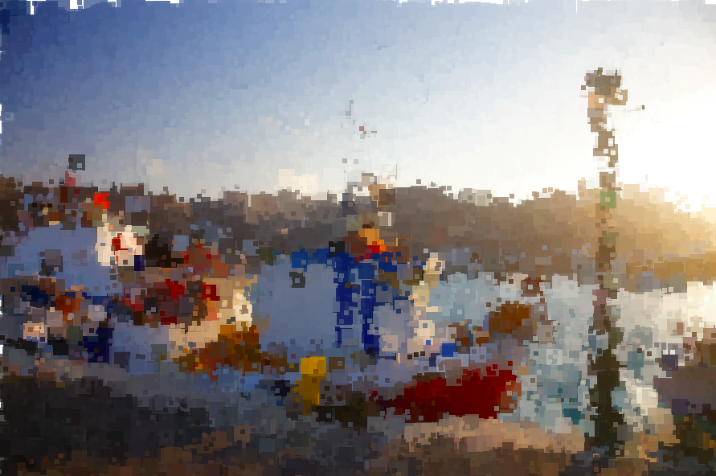

# Rectangulate: p5.js
This is a program to draw squares based on the loaded image from the assets.
https://ksenia007.github.io/rectangulate/

The position of the rectanges is selected randomly, and the color is based on the underlying image. The size of the square decreases with the iteration. 

      
      

